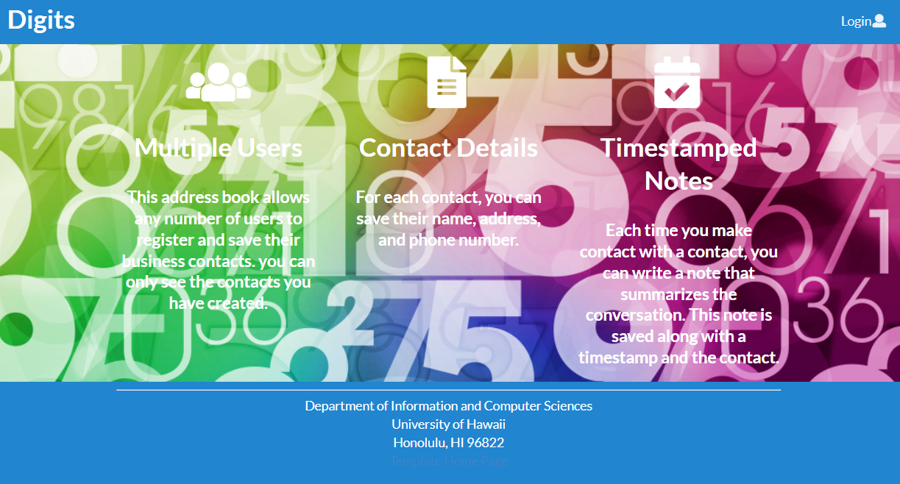
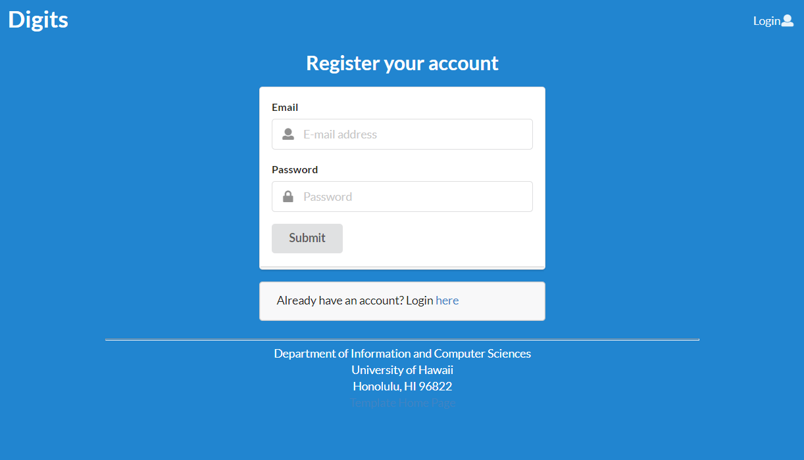
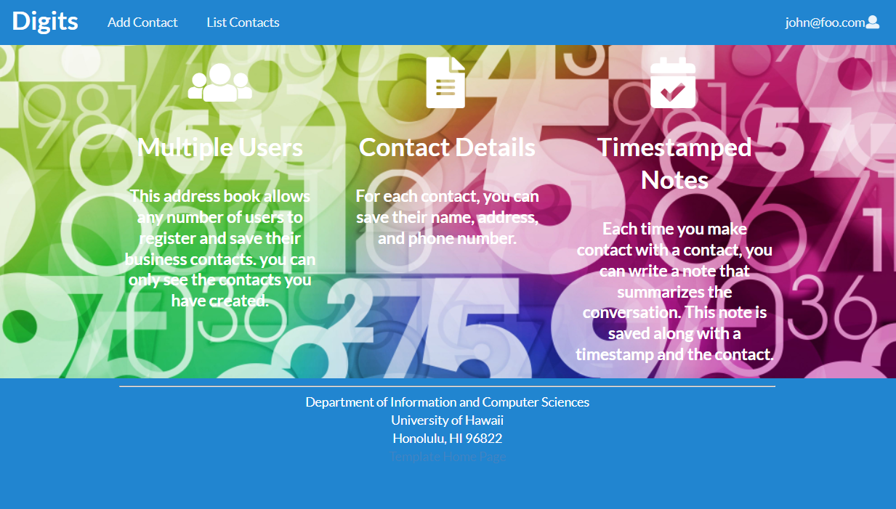
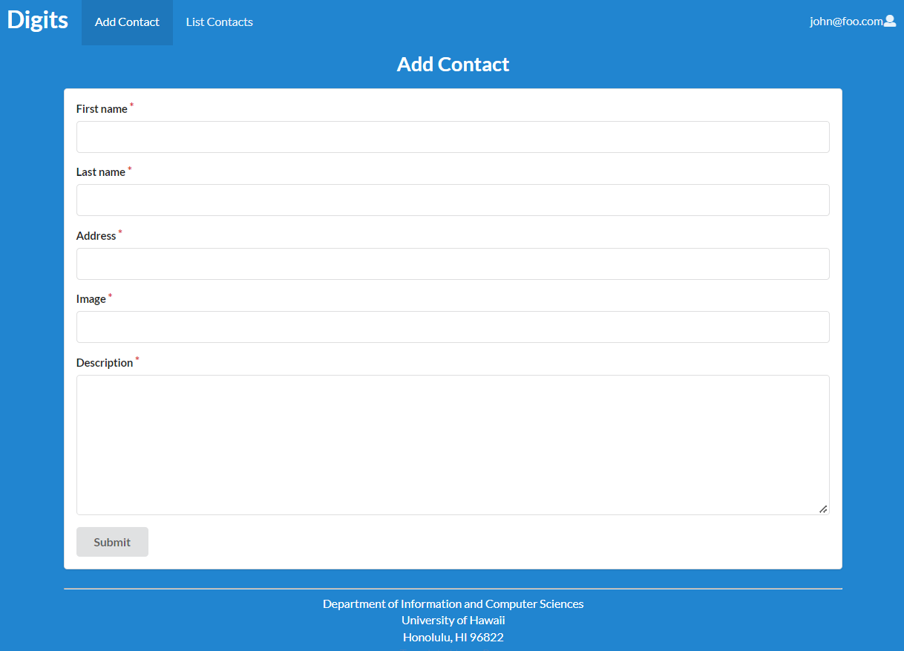
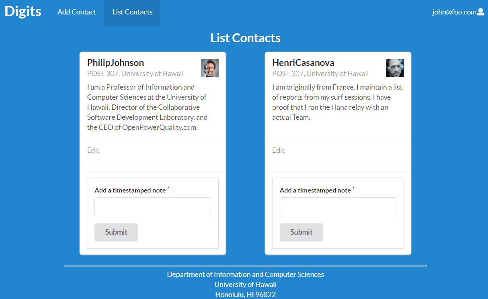
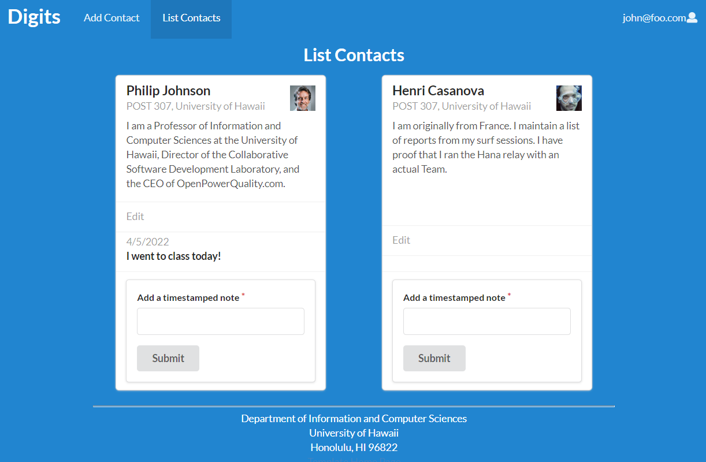
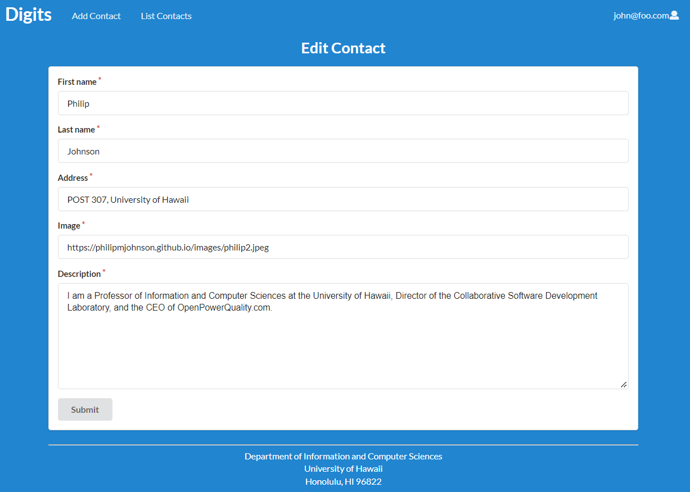
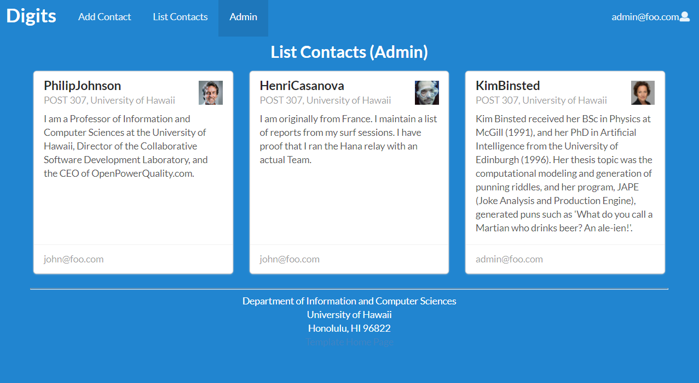

Digits is a application that users can use to:
  * Register an account
  * Create and manage contacts
  * Add timesamped notes to those contacts

## Installation

First, [install Meteor](https://www.meteor.com/install).

Second, [download Digits](https://github.com/jiahuiliao/digits) by first requesting access.

Third, cd into the app/ directory and install third party libraries with:

```
$ meteor npm install
```

Once the libraries are installed, you can run the application by invoking the "start" script in the [package.json file](https://github.com/ics-software-engineering/meteor-application-template-react/blob/master/app/package.json):

```
$ meteor npm run start
```

Once you run the app, you might see an output similar to the below:

```

PS C:\Users\cette\Documents\GitHub\digits\app> meteor npm restart

> meteor-application-template-react@ start C:\Users\cette\Documents\GitHub\digits\app 
> meteor --no-release-check --exclude-archs web.browser.legacy,web.cordova --settings 
../config/settings.development.json

[[[[[ C:\Users\cette\Documents\GitHub\digits\app ]]]]]

=> Started proxy.
=> Started MongoDB.                           
=> Started your app.

=> App running at: http://localhost:3000/
   Type Control-C twice to stop.

```

Additionally, you are able to run over the code to view any errors by running ESLint.

```
meteor npm run lint
```

## Walkthrough

### Landing
Once the application is loaded, you will be met with an introductory page listing what Digits is able to do.


### Signing up
If you do not have an account, you are able to sign up by clicking "Login" and then "Sign Up".



### Signing in
If you have an existing account, you are able to sign in by clicking "Login" and then "Sign In".


### User home page
Once logged in, users have access to home page with the NavBar now displaying "Add Contact" and "List Contacts".


### Add Contacts
After logging in, users are able to navigate to "Add Contact" in the NavBar to create a contact. These contacts include name, address, and a description.



### List Contacts
Navigating to "List Contacts" in the NavBar allows users to view the associated contacts with their user.



Users are able to add timestamped notes to the contacts.




### Edit Contacts
Users are able to edit contact information by clicking the "Edit" link in the List Contacts page. 



### Admin
Users designated admin in the system through the settings file are able to access the "Admin" tab in the NavBar. This leads to a page listing all available contacts in the system, displaying which contact belongs to which user. 


